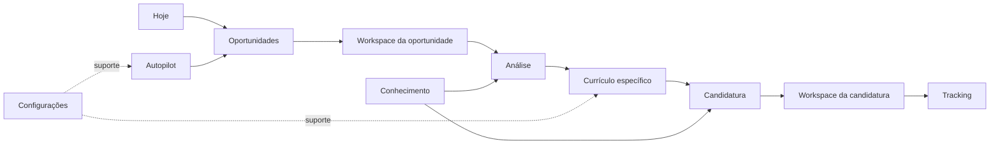

# Mapa de navegação

```mermaid
flowchart LR
  H[Hoje] --> O[Oportunidades]
  O --> OW[Workspace da oportunidade]
  OW --> A[Análise]
  A --> R[Currículo específico]
  R --> AP[Candidatura]
  AP --> AW[Workspace da candidatura]
  AW --> T[Tracking]
  AU[Autopilot] --> O
  K[Conhecimento] --> A
  K --> AP
  S[Configurações] -. suporte .-> AU
  S -. suporte .-> R
```

Rotas principais e rotas profundas estão no [inventário de features](../frontend-feature-inventory.md).
